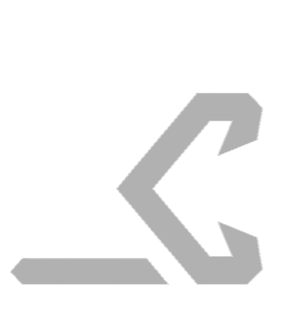

<p align="center">
  
</p>

<p align="center">
  <a href="https://github.com/darkian-studio/app/releases"></a>
  <a href="https://github.com/darkian-studio/app/releases"></a>
  
  
</p>

# Darkian Studio

**Darkian Studio (DS)** is a real, mobile-first IDE that runs on Android and Linux. It brings a code editor, integrated terminal, Language Server Protocol (LSP) support, debugging, and git into a single app — powered by a [Termux](https://termux.dev) or system runtime.

**Website & docs:** <https://darkian-studio.github.io> — install guide, troubleshooting, comparisons, and FAQ.

<p align="center">
  <video src="assets/videos/ds_demo.mp4" controls width="320" poster="assets/images/watermark.png"></video>
</p>

This repository (**darkian-studio/app**) is the **public support and release home** for Darkian Studio. The application source code is private; this repo exists so external users can download releases, report bugs, request features, and read diagnostics guidance.

> **Status:** First public **beta**. Expect rough edges. See [Known Limitations](#known-limitations).

---

## What is Darkian Studio?

- **Editor** — syntax highlighting, multiple languages, command palette.
- **Terminal** — a full shell through your runtime (Termux on Android).
- **LSP & debugging** — language intelligence and breakpoints.
- **Git** — clone, commit, push, and review changes.
- **Extension host** — a sidecar runtime for optional editor extensions.

DS is designed for developers who want a genuine coding environment on a phone or tablet, tethered to a real runtime rather than a toy sandbox.

---

## Current beta status

This is the **first public beta**. We are focused on:

- Making onboarding reliable (one setup command provisions the runtime).
- Capturing useful diagnostics inside the app instead of requiring ADB/Flutter.
- A simple, transparent update path via GitHub Releases.

The app is **not** on the Play Store. APKs are distributed here as GitHub Releases only.

---

## How to install

1. **Install Termux** from F-Droid (the Play Store build is outdated and breaks DS): <https://f-droid.org/en/packages/com.termux/>
2. **Download the latest DS APK** from the [Releases page](https://github.com/darkian-studio/app/releases).
3. **Open DS** and complete onboarding. On the *Run the setup* step, copy the command and paste it into Termux:

```sh
pkg install curl; curl -fsSL https://raw.githubusercontent.com/darkian-studio/app/main/install.sh | bash
```

4. Tap **Verify setup** in DS. Once it reports the runtime is ready, you are done.

The setup script is **runtime aware**: it uses the correct commands for **Termux**, **Linux** (apt/pacman/dnf), and **macOS** (Homebrew), skips already-installed components, and verifies the result before exiting.

---

## How to report bugs

Please use the **Bug report** issue template: <https://github.com/darkian-studio/app/issues/new?template=bug_report.yml>

Before filing, gather the information below so we can reproduce quickly.

### How to attach diagnostics / logs

DS keeps its own logs and crash reports — you do **not** need ADB or Flutter.

1. Open **Settings → Diagnostics → Diagnostics logs**.
2. Use the **copy** action (top bar) to copy the full log buffer.
3. If the app crashed, also open **Settings → Diagnostics → Crash reports** and copy the relevant report.
4. Paste both into the bug report, or attach them as files.

You can redact paths/identifiers; please keep timestamps and error messages intact — they are what we use to triage.

---

## Where APKs are downloaded

All official APKs live on the [GitHub Releases page](https://github.com/darkian-studio/app/releases). There is **no Play Store build** and no other distribution channel. If you obtained a DS APK from elsewhere, do not trust it.

Inside the app, go to **Settings → About → Check for updates** to compare your installed version against the latest release. A startup check also notifies you when a newer beta is available.

---

## Known limitations

- **`dsterm` remote on Windows fails.** Connecting a DS workspace to a Windows-hosted `dsterm` endpoint is not supported in this beta; use Termux or a Linux/macOS host for remote runtimes.
- The setup script provisions the runtime on the **device/local host** only.
- Extension host features are opt-in and may be limited on low-end devices.
- Beta tags may ship with breaking changes between releases.

---

## Comparisons

Darkian Studio routes its editor, terminal, language servers, debugger, Git, and extensions through one runtime, reached over a bridge. That is a different architecture from a desktop IDE or a lightweight mobile editor.

| Compare with | Summary |
|--------------|---------|
| VS Code | Desktop app on a full OS versus DS's mobile-first workflow over a runtime bridge. |
| Acode | Mobile editor with a PTY/LSP backend versus DS's single runtime for editor, LSP, debugger, and extensions. |

Read the detailed comparisons:

- [docs/comparisons/vscode.md](docs/comparisons/vscode.md)
- [docs/comparisons/acode.md](docs/comparisons/acode.md)

---

## Discussions & feature requests

- **Feature requests:** use the template at <https://github.com/darkian-studio/app/issues/new?template=feature_request.yml>
- **General questions / show-and-tell:** use [GitHub Discussions](https://github.com/darkian-studio/app/discussions).

We do **not** accept code contributions to the application here — see [CONTRIBUTING](CONTRIBUTING.md). This repo is for issues, discussions, and releases only.

---

## License

The DS application is proprietary. This repository's support content (README, templates, scripts) is provided for user support under the terms in each file.
